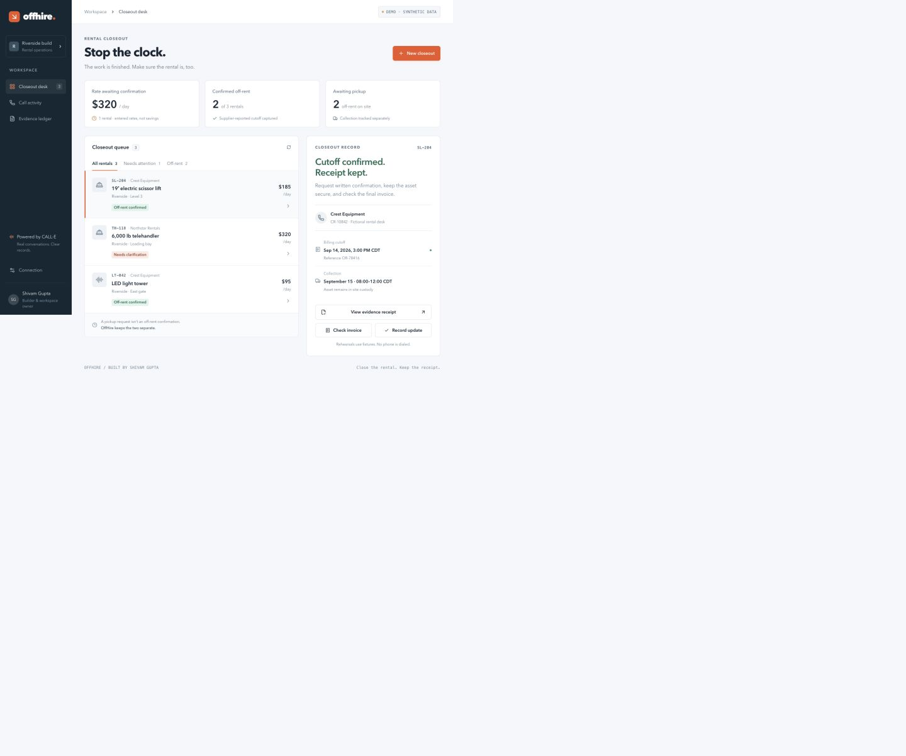

# OffHire

**The work is finished. Make sure the rental is, too.**

OffHire is a contractor's rental closeout desk, built by **Shivam Gupta** for [CALL-E: Your Code Is Calling](https://call-e.devpost.com/). It uses CALL-E to verify an existing equipment off-rent request, captures the supplier's billing cutoff and reference, and keeps collection outstanding until the site team records it.

The memorable case: **“We'll pick it up tomorrow” leaves billing unconfirmed.** A completed phone call alone never closes a rental.



## Try it

[Hosted application](https://offhire-shivam.sg127977958.chatgpt.site) — currently owner-private; public judge access is pending approval. The local demo below is available to everyone.

**Validation status:** the offline regression suite and local HTTP/D1 workflow pass. The Firebase standalone build and 51 Firestore/auth/HTTP emulator checks also pass. A real CALL-E owned-number test has not yet been conducted; synthetic transcripts are labeled throughout.

The application opens in a **clearly labeled demo workspace**. The businesses, rental records, rates, transcripts and outcomes are synthetic. Rehearsals exercise the same decision engine as live calls and never dial a phone.

1. Select the scissor lift and choose **Preview call plan → Run rehearsal**.
2. Open its evidence receipt. The cutoff, exact reference and complete rental-desk quotations are separate from the pickup window.
3. Select the telehandler. Collection is scheduled, but its billing cutoff stays open.
4. Try **A later correction**, **Voicemail**, **Unsupported evidence**, or **Wrong asset** on an unresolved rental.
5. Check an invoice end date, record physical collection, and export the evidence ledger.

Reset the sample records from **Connection → Reset sample scenario**. Each browser session gets its own persisted demo records. Live records require an approved operator.

The standalone [OffHire CLI reference](examples/offhire-cli/README.md) runs without a hosted service and offers an explicitly authorized owned-number roleplay. It is also contributed to CALL-E’s examples repository.

## Local setup

Requires Node **22.13+** and npm. No CALL-E account is needed for the demo or tests.

```sh
git clone https://github.com/shi1720/call-e.git
cd call-e
npm ci
npm run setup
npm run dev
```

Open the URL printed by the server, normally `http://localhost:5173`. `setup` builds the Worker and applies the actual SQL migrations to a local D1 database. It does not deploy or place calls. Subsequent setup runs apply only pending local migrations.

```sh
npm test                 # pure behavior + actual service/SDK/SQLite regression tests
npm run typecheck
npm run build
npm run test:smoke        # with npm run dev running; HTTP routes and actual local D1
```

The service tests run the real CALL-E SDK against a closed fake transport. They exercise SDK serialization, idempotency, real SQL constraints, transaction races, callbacks and recovery. They make **zero live network requests**. See [Testing](docs/testing.md).

## What a real call does

The server imports `CalleClient` from **`@call-e/calle@0.7.0`** and invokes `calls.create` at runtime. It persists the exact request and stable idempotency key before dispatch, saves the returned Call ID, and uses `calls.get` for reconciliation.

The call is scoped to **one asset on one existing rental contract**. The agent identifies itself as an AI assistant, verifies the representative and exact asset/contract, asks for the effective billing cutoff with timezone and the off-rent reference, reads them back, then asks about collection separately. It can request written confirmation to the customer's existing address. It cannot accept fees, purchase equipment, change terms or return another asset.

**Live setup is intentionally separate.** Read [Live connection and owned-number test](docs/live-setup.md), configure server secrets from `.env.example`, sign in as an allowlisted operator and add an explicitly authorized number. A hard account call budget defaults to five, with one call at a time. The public demo never gains access to those records or credentials.

CALL-E's current callbacks are unsigned. OffHire treats the callback as a wake-up signal, checks its event ID and private URL token, and retrieves the saved call through the authenticated API before changing any business state. Failed retrieval stays retryable. [Provider contract notes](docs/call-e-integration.md)

## The product distinction

| Fact                    | Evidence required                                                                                               | What remains open                                                       |
| ----------------------- | --------------------------------------------------------------------------------------------------------------- | ----------------------------------------------------------------------- |
| Reported billing cutoff | Exact asset/contract, explicit cutoff/date/time/timezone, off-rent reference and transcript-supported read-back | Official written confirmation and final invoice review                  |
| Collection arranged     | Rental-desk statement with a collection window                                                                  | Physical collection and site custody                                    |
| Collected               | Operator records who observed collection                                                                        | Any unresolved billing or invoice question                              |
| Invoice review flag     | Entered billed-through date later than the reported cutoff day                                                  | Human contract and invoice review; no automatic dispute or refund claim |

The engine matches **complete callee turns**, distinguishes the bot's speech, checks identifier boundaries and date/time support, and rejects later contradictions. It deliberately sends unfamiliar or ambiguous phrasing to review. These rules reduce false confirmations; they are not a general proof that every possible conversation is understood.

The rate metric is **entered daily rates awaiting confirmation**, separated by currency. It is not accrued loss, recovered money or invoice-verified savings. Future supplier-reported cutoffs can be confirmed without implying billing has already stopped.

## Why build this business?

Off-hire already has an industry-defined process. The [IPAF Rental Standard, sections 9.11–9.13](<https://www.ipaf.org/sites/default/files/2023-12/IPAF%20Rental%20Standard%20(Including%20Guidance%20for%20Rental%20Companies)%20RP-3-EN--V3.1-20231208.pdf>) separates off-hire reference handling from collection. Supplier terms vary, and portals already solve many straightforward requests.

OffHire's proposed customer is a contractor or rental broker coordinating several suppliers and repeated **missing or ambiguous confirmations**. It complements supplier portals and rental-management software. An already complete portal request should not trigger a ceremonial AI call.

The pilot hypothesis is **$99/company/month plus measured CALL-E usage at cost**. Forty monthly events × eight minutes × 75% less administration = four modeled staff hours, worth $160 at an assumed $40/hour. Those are test inputs, not observed savings or validated willingness to pay. [Business case and primary research](docs/business-case.md)

## Architecture and operating limits

React 19 and TypeScript, with a Firebase deployment path using Next.js, Cloud Run, Firestore and Google sign-in. The original Sites/Vinext Worker path retains D1 persistence with schema-only Drizzle migrations; the official CALL-E TypeScript SDK; Radix dialog primitives and Lucide icons. [Architecture](docs/architecture.md)

- Server-enforced ownership, exact destination allowlist, business hours for real suppliers, explicit plan approval and 15-minute grants.
- Durable account lock, one budget reservation per job, atomic compare-and-swap state updates and monotonic terminal receipts.
- No automatic redial. Lost create responses keep the account locked; recovery uses the **same exact request and key**.
- A saved Call ID can always be read after approval expires. An expired uncertain create cannot be replayed without external reconciliation.
- CALL-E's API currently has no cancel operation. Closing a page or stopping local polling does not cancel an accepted call.
- Callbacks can finish a workflow with the browser closed. If callbacks are unavailable, the open application polls, and a returning operator can refresh the saved call. No autonomous scheduler is claimed.
- Up to 100 rentals and 200 reviewed plans per workspace. English extraction rules intentionally favor review over broad-language guessing.
- Live authentication assumes the Sites gateway supplies trusted identity headers. A directly exposed standalone Worker needs an authenticating gateway that strips client-supplied identity headers. Do not expose the local mock sign-in server.

This is a tested hackathon MVP. Production rollout still needs a real supplier pilot, provider number/KYC arrangements, monitoring, retention operations and a measured cost envelope. See [Security and deployment](docs/security.md).

## Submission and credits

- [CALL-E contribution PR #664](https://github.com/CALLE-AI/awesome-phone-call-agents/pull/664)
- [Product brief](docs/pitch/OffHire-Product-Brief.pdf) · [Editable pitch deck](docs/pitch/OffHire-Pitch.pptx)
- [Demo narration and recording guide](docs/video-script.md)
- [Timed walkthrough narration](docs/walkthrough-assembly.md)
- [Reproducible video and generated narration](tools/media/README.md)
- [Devpost draft](docs/devpost.md)
- [Submission checklist](docs/submission-checklist.md)
- [Specific CALL-E feedback](docs/call-e-feedback.md)
- [License](LICENSE): MIT, © 2026 Shivam Gupta.

Shivam Gupta is the project owner and builder. The application uses open-source libraries and an AI-assisted development workflow. Third-party trademarks belong to their owners. All demo supplier names and scenarios are fictional.

## Firebase deployment

With your Firebase project and Google sign-in already set up, run:

```sh
git pull
npm run deploy:firebase
```

The script asks for your **existing project ID**, **Hosting site ID** (default `offhire`) and **operator Google email**. It creates/reuses the service accounts and Firestore database, discovers your Firebase web configuration, adds the Hosting domain to Google sign-in's authorized domains, and deploys Cloud Run plus Firebase Hosting. It prints the URL after checking the app, Firebase configuration and demo database access.

Use [Google Cloud Shell](https://shell.cloud.google.com/) or a Mac/Linux terminal with Node 22.13+ and `gcloud`. The script downloads the Firebase CLI as needed and guides CLI sign-in. No `npm ci`, local Docker or API-key copying is required to deploy the rehearsal. The build runs in Google Cloud.

To supply the values directly:

```sh
npm run deploy:firebase -- --project YOUR_FIREBASE_PROJECT_ID --site offhire --owner YOUR_GOOGLE_EMAIL
```

The `offhire` site ID must be available or already belong to that project. Settings are saved in ignored `.deploy/firebase-deploy.json`; rerun the same command for updates. A first deploy keeps live calls disabled; updates preserve existing CALL-E secret bindings, destination allowlists, call budgets and live settings. The script reuses linked billing. If billing is missing, it lists open accounts and links the one you select; choose the account holding your GCP credits. Linking changes Firebase to Blaze, and credit coverage depends on your credit terms and expiry. An active project is never silently moved to another billing account.

[Full deployment details, prerequisites and optional live-call secret setup](docs/firebase-deployment.md). Script workflow tests run with `npm run test:deploy`; they use fixture responses and do not create cloud resources. Actual cloud deployment is verified when you run the deploy command.
