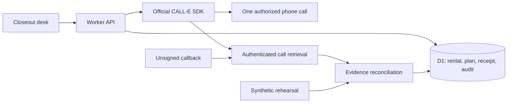

# Architecture

The UI is a closeout desk for one shared live operator workspace and isolated demo workspaces. A browser's random HttpOnly cookie identifies its demo records. Live access requires trusted Sites identity headers and the server's operator email allowlist.

## Files and boundaries

- `app/page.tsx`: responsive desk, plan approval, six rehearsals, transcripts, invoice comparison and recorded follow-through.
- `app/api/[...path]/route.ts`: JSON API, session/workspace access, validation, callbacks and exports.
- `lib/server/service.ts`: planning, dispatch, capacity/budget reservations, recovery and reconciliation.
- `lib/server/store.ts`: D1 prepared statements, exact-payload compare-and-swap and terminal lock release.
- `lib/server/provider.ts`: official SDK create/get/authentication calls, 25-second request timeout and SDK-to-domain mapping.
- `lib/offhire/call-plan.ts`: one-rental task compiler and provider result schema.
- `lib/offhire/decision.ts` / `evidence.ts`: pure conservative evidence projection.
- `lib/offhire/fixtures.ts`: explicitly synthetic sample data; never used to fabricate live results.
- `db/schema.ts` / `drizzle/`: schema and generated migrations. No runtime CREATE TABLE.

## Durable call lifecycle

Preparing a plan saves the exact serialized create body, an unpredictable idempotency key and a 15-minute dispatch grant. It does not dial. Dispatch rechecks operator scope, destination, readiness, consent, capacity, business hours and current rental evidence.

A unique account lock allows one active call. A unique budget reservation per job prevents a replay consuming a second reservation. A database compare-and-swap claims dispatch only if the job payload still matches and the grant remains valid. Definite provider rejection terminates the job. A lost/ambiguous response preserves the body, key and lock, because CALL-E may have accepted it.

Recovery with a saved Call ID performs GET only, even after grant expiry. Without an ID it replays the same request/key only while the original grant permits it. A stale database writer cannot erase a newer Call ID or terminal receipt. An atomic per-workspace decision sequence determines receipt order even when wall-clock timestamps tie. Terminal update and matching lock release occur in one transaction. Provider events are deduplicated only after authenticated retrieval succeeds.

No autonomous scheduling is included. An open browser polls active calls; configured reachable callbacks can complete records with the browser closed. Returning operators can refresh saved calls.

## Business state is separate from call state

CALL-E `completed` or `taskCompleted` is not an off-rent confirmation. A confirmed billing projection needs one completed conversation, affirmative exact asset/contract identity, an explicit date/time/timezone, a supported off-rent reference and a transcript-supported read-back, without later contradictions.

Every quote must equal a full callee turn; bot speech and clipped positive substrings cannot support a supplier fact. Collection has independent affirmative-language and verbatim-window checks. Physical collection, written confirmation and invoice review are separate operator attestations with audit notes. Invoice comparison uses the reported local cutoff day and creates a review flag only.

English date/time and phrase recognition is intentionally narrow. Unsupported wording can produce false negatives needing review. There is no claim of universal natural-language correctness.

## Limits

100 rental records and 200 plans per workspace; up to 20 plans per asset; one concurrent live call and a configured lifetime call budget. The UI is not a full rental accounting system: no contract ingestion, automatic invoice parsing, autonomous email, supplier portal import or calendar scheduler is included. Public rehearsals persist in D1; the cookie lasts seven days, but database retention cleanup must be operated separately.
